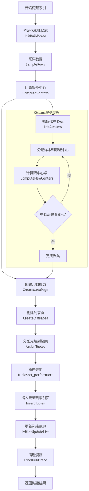
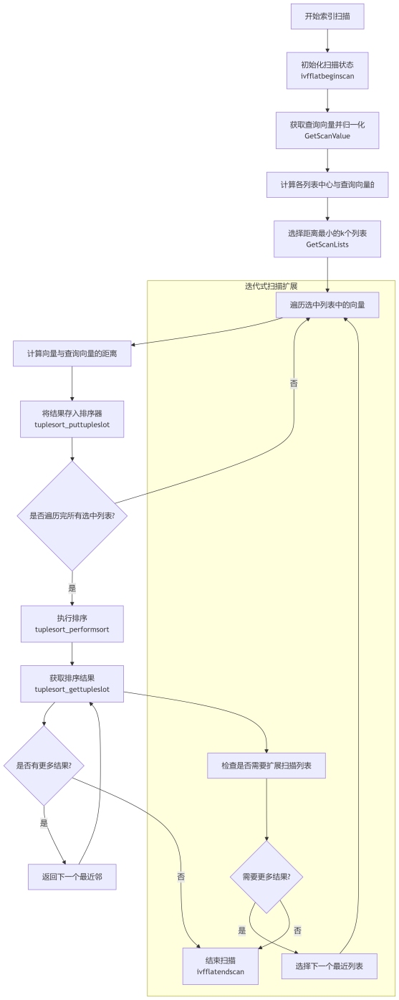
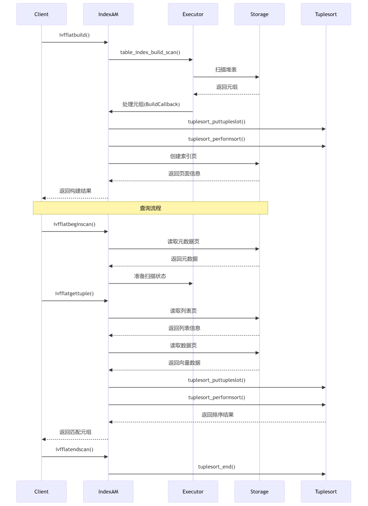
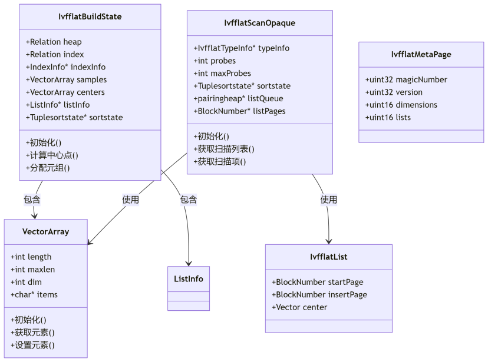

# 代码阅读

## 参考：网上的开发者文档
**参考链接** https://opendeep.wiki/pgvector/pgvector/developer-guide

### 个人认为重要的部分
开发者指南：内部实现
- 核心vector内容实现
    vecotr结构体的定义，如何用sql插入和查找向量、pgvector数据流
- 查询与距离运算
    操作符中余弦距离和L2距离（我们ivfflat应该只支持这俩）、pgvector数据流
- 使用IVFFlat索引
    能从宏观层面上了解IVFFlat架构

SQL-API参考：教你怎么写sql，可能写测试脚本能用到

## 项目结构 by 章毅
聚类流程图：\
 \
扫描流程图：\
 \




## 日志系统 &　debug
日志文件在/var/log/postgresql/postgresql-16-main.log 
可以用例如
```
elog("LOG", "there is a number %d", 1);
```
的形式将debug信息输出到日志，除此之外，我没有找到更好的Debug方式。

# 分工
1. （**章毅**）按周会ppt里的介绍实现并行查询逻辑，先别管gpu算子，把数据走通并且传到gpu上就行。大概的实现步骤如下：

    1. 串行ivfflat中，pgvector使用postgresql中的 ```ScanKey``` 数据结构，它似乎不支持存储一组向量。我们要仿照```ScanKey```的使用方式。在```scanbatch.c```实现一个```ScanKeyBatch```及访问的相关方法，query的向量数据在内存上要连续，方便cpu-gpu传输。
    2. 实现一个方法，将聚类中心传到gpu，使用零拷贝内存
    2. 实现一个方法，将选定聚类的页面传到gpu，也许使用零拷贝内存
    4. 更改OrderBy的行为，串行搜索时输出的表有两列 ```|id|distance|```，而并行输出时输出的表有三列 ```|query_id|id|distance|```，排序行为应默认对```query_id```进行排序，再对```distance```进行排序
    5. 将并行SELECT的结果改为输出```|query_id|id|distance|```三列的表


2. （**龙俊宇**）完善并测试查询算子：
    1. ```search_batch_cosine_distance```: \
        参数：\
        ```float* query``` 形状 [N1,D]，\
        ```float* data``` 形状[N2,D]。其中 N2 比较大，要分批上传。\
        ```int k```: 距离最近Top-k中的k值 \
        输出：\
        ```int* result``` 形状[N1,k]，内容是data中和query距离最近的top-k的data的序号

    2. ```search_batch_l2_distance```: \
        参数：\
        ```float* query``` 形状 [N1,D]，\
        ```float* data``` 形状[N2,D]。其中 N2 比较大，要分批上传。\
        ```int k```: 距离最近Top-k中的k值 \
        输出：\
        ```int* result``` 形状[N1,k]，内容是data中和query距离最近的top-k的data的序号
    
    先随机生成一些数据测试，离线测试这些算子的性能，别急着加到系统中。

    可以参考```pgvector/cuda```中我初步实现的一些算子，```pgvector/test_cuda```中有他们的测试函数：
    1. ```distances.cu```中有余弦函数算子
    2. ```matrix-multiply.cu```中有矩阵乘法算子
    3. ```normalize.cu``` 中有规范化算子
    4. ```kernels.cu``` 中有所有的核函数

3. （**陈驭良**）把ann-benchmarks的数据集搬到数据盘（系统盘快满了），然后在ann-benchmark上支持TEXT(Text-to-Image)数据集，在原版pgvector上跑通。链接:https://research.yandex.com/blog/benchmarks-for-billion-scale-similarity-search#13h2。整个数据集太大了，先用10M的子集就行

# 合作方式

1. 克隆我的autodl容器到一个单卡V100 gpu上进行开发和实验，优势如下
    - ann-benchmarks的baseline测试环境已经完全配好，开发环境约等于中兴测试环境（**章毅可以到ann-benchmarks下pull一下，更新我的最新更改**）
    - 不会和别人抢gpu，便于监控gpu情况
    - 服务器稳定，我没见过autodl挂过

2. 这个容器内有几个重要的文件夹：
    - /root/pgvector: 这是我们正在修改pgvector，大家需要fork我的pgvector仓库 https://github.com/mindtravel/pgvector.git ，把远程仓库地址设成你们的，然后再ivfflat-gpu分支上进行开发和提交。
    - /root/ann-benchmark: 只要会编辑和运行```./scripts/tests/```里面的几个脚本就行：\
        ```test_simple.sh```：用小数据集测试，一般测试直接跑这个就行，这个脚本会调下面的几个脚本。\
        ```pgvector_ours.sh```：测试我们的pgvector，可以选择测gpu、多线程、单线程\
        ```pgvector_origin.sh```：测试原版pgvector，可以选择测多线程、单线程\
        ```cuvs.sh```：测试cuvs，可以选择测cuvs_ivfflat，cuvs_ivfpq\
        ```compile.sh```：编译pgvector拓展并移动到postgresql中，可以选择编译baseline, ours

3. 多多交流，有问题及时问

