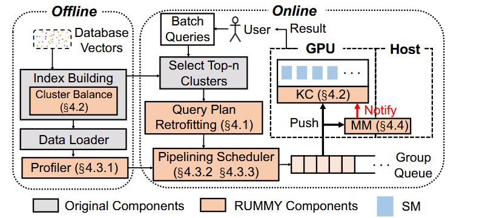
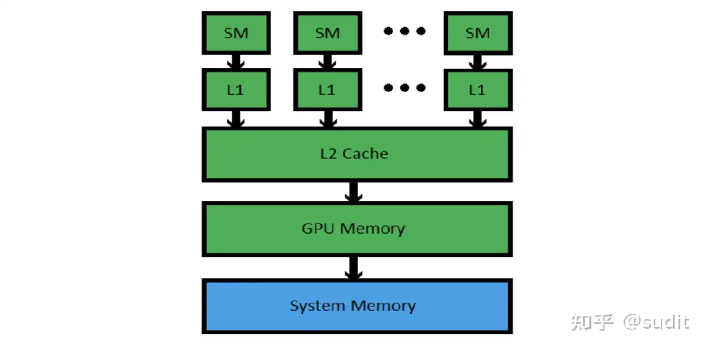
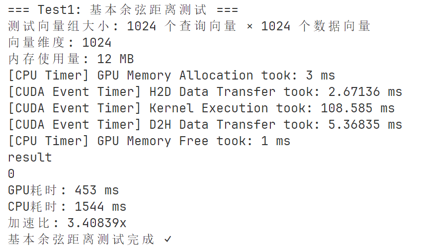
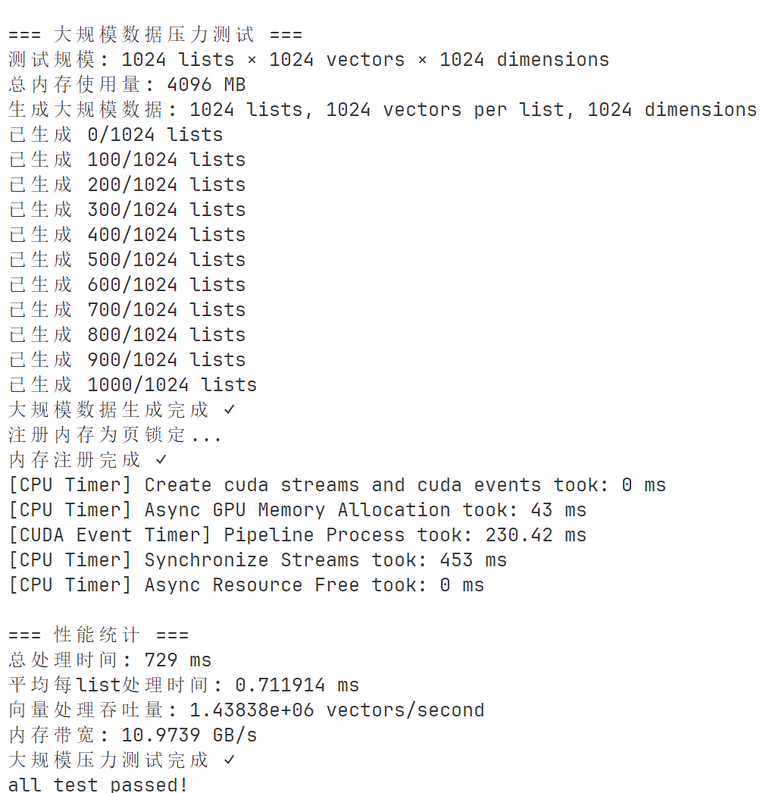
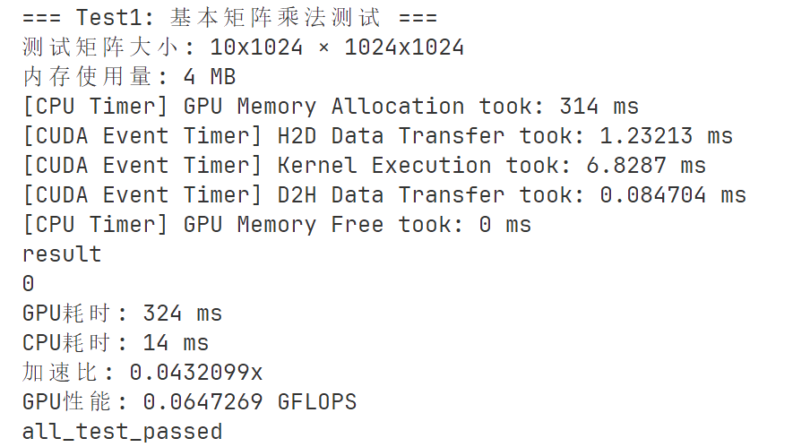

目前的性能瓶颈出现在从存储中加载向量到gpu的过程，因为gpu显存不足，每次查询的n_probe个簇都不一样，数据传输开销很大。所以我需要知道这些簇中的向量从存储中加载到gpu需要经过什么过程？实现中有什么需要注意的地方？

## 项目介绍
**PostgreSQL** 是一款功能强大的开源对象-关系型数据库管理系统（ORDBMS），以严格遵循 SQL 标准、支持完整 ACID 事务、多版本并发控制（MVCC）以及高度的可扩展性（如支持自定义函数、数据类型和扩展如 PostGIS）著称。其市场地位稳固，是**2025年StackOverflow调研中最流行、最受喜爱和需求量最高的数据库，开发者使用率超55%**，领先优势明显

**pgvector**是postgresql向量数据库实现的**事实标准**

我们正为pgvector添加**首个向量查询的gpu加速支持**

### Things to do:
1. 添加TEXT数据集支持
2. 更改批量查询的order_by查询，支持对每个query按照距离排序，再整合成一张表输出
3. 添加pgvector-python库支持，**包括将ndarray输入到数据库中**，将数据库中的表格变成可供ann-benchmark识别的结果

## 参考：rummy


**三个优化点**
1. 不同查询之间造成数据加载冗余
2. 如果一个聚类只使用一个SM，那么GPU使用会不充分
3. 优化查询顺序使得传输时间和计算时间尽可能重合

## 数据库构建、串并行查询对比

**定义**
1. data向量：存在数据库中的向量，
2. query向量：搜索的向量
3. target向量：返回的k-近邻，是data向量的子集

**数据库查询**
data向量传入数据库——>聚类，建立ivfflat索引——>逐次输入query查询并返回回target

**串行查询**：
逐次输入query向量：query和聚类中心比较选出待筛选聚类——>将对应聚类的所有向量轮流和query比较——>得到query的target

**并行查询（暂定）**：
一次输入所有query_batch，分query_batch做查询：query_batch和聚类中心比较选出待筛选聚类——>将对应聚类的所有向量轮流传上gpu，进行比较——>得到query_batch的target

聚类中心始终常驻显存（暂定，测试集肯定能这么跑）

## 测试数据集
| Dataset                                                           | Dimensions | Train size | Test size | Neighbors | Distance  | Download                                                                   |
| ----------------------------------------------------------------- | ---------: | ---------: | --------: | --------: | --------- | -------------------------------------------------------------------------- |
| [DEEP1B](http://sites.skoltech.ru/compvision/noimi/)              |         96 |  9,990,000 |    10,000 |       100 | Angular   | [HDF5](http://ann-benchmarks.com/deep-image-96-angular.hdf5) (3.6GB)        |
| [SIFT](http://corpus-texmex.irisa.fr/)                           |        128 |  1,000,000 |    10,000 |       100 | Euclidean | [HDF5](http://ann-benchmarks.com/sift-128-euclidean.hdf5) (501MB)          |
|TEXT|-|-|-|-|-|ann-benchmarks上没有支持，需要添加


数据集不算大，可以常驻内存。如果测试集很大，要搞磁盘——>内存——>GPU，可能会更费事一些 

## 可行性分析

假设按照ann-benchmarks中的最高标准：一个形状为[N,D]的向量，N为1M级别，D为1K级别，则一个向量4KB

我们采用如下策略：
- 1K个聚类中心常驻显存(4MB)
- 10K个query输入后常驻显存(40MB)

测试框架中，一个批次是静态的、固定的，我们知道任意一个聚类要和哪些query计算距离。所以，数据总量约等于数据集大小，所以：
- 每个cluster只输入一次，(1M vectors占4GB) \
- **总共约占显存4GB**，（甚至可以让数据集常驻显存，但这显然不可推广的做法） \

鉴于memory-bound，我们将总的数据传输时间当作总查询时间：
- 如果1s内完成的话(吞吐量10^4)，我们**只需要将双向数据带宽达到8GB/s**就可以，而我们的PCIE总线带宽有32GB。

这样的估算有如下问题：
- 没有考虑cpu处理时间，仅按照数据流量估计（较轻的高估）
- 仅考虑一个cuda流，实际上面我们每次只用了几百MB的显存，单卡V100有16G显存（较严重的低估）

结合其他gpu向量数据库的表现，我认为**我们可以在实现尽可能简单的情况，实现合同目标**

## TOAST机制
在数据大小超过一定阈值（默认单向量2KB）时触发，所以可以设较大的TOAST阈值先绕过


## pgvector ivfflat索引的向量加载过程分析

### 1. 向量存储结构

Vector类型：```vector.h```
最基础的向量类型，各种操作都支持
```c
typedef struct Vector
{
    int32       vl_len_;        /* varlena header */
    int16       dim;            /* 维度数 */
    int16       unused;         /* 保留字段 */
    float       x[FLEXIBLE_ARRAY_MEMBER]; /* 向量数据 */
} Vector;
```

VectorBatch类型：```vector_batch.h``` \
**新增**：用来传入一批次向量
```c
typedef struct VectorBatch
{
	int32		vl_len_;		/* varlena header */
	int16		count;			/* 向量数量 */
	int16		dim;			/* 向量维度 */
	int32		unused;			/* 保留字段 */
	Vector		vectors[FLEXIBLE_ARRAY_MEMBER];  /* 向量数据 */
} VectorBatch;
```

1. 支持在ann-benchmark-sql-c各个环节使用vector-batch

2. 对比 ```VectorArray```：这是一个在 ```ivfflat.h```中实现的数据类型，用于高效建立ivfflat索引，鉴于我们不动建索引的过程，就不使用这个数据结构了


### 2. 向量加载的关键流程

#### 2.1 候选聚类选择阶段 (`GetScanLists`)
```48:50:pgvector/src/ivfscan.c
cbuf = ReadBuffer(scan->indexRelation, nextblkno);
LockBuffer(cbuf, BUFFER_LOCK_SHARE);
cpage = BufferGetPage(cbuf);
```

- 从磁盘读取聚类中心页面
- 计算查询向量与各聚类中心的距离
- 选择最近的n_probes个聚类

#### 2.2 向量数据加载阶段 (`GetScanItems`)
```131:133:pgvector/src/ivfscan.c
buf = ReadBufferExtended(scan->indexRelation, MAIN_FORKNUM, searchPage, RBM_NORMAL, so->bas);
LockBuffer(buf, BUFFER_LOCK_SHARE);
page = BufferGetPage(buf);
```

- 遍历选中的聚类页面
- 从每个页面读取向量数据
- 计算与查询向量的距离并排序

### 3. 性能瓶颈分析

您提到的性能瓶颈主要出现在以下环节：

1. **页面读取开销**：每次查询需要读取n_probes个不同的聚类页面
2. **内存拷贝开销**：从PostgreSQL缓冲区到应用内存的数据拷贝
3. **向量解压缩**：PostgreSQL的TOAST压缩机制
4. **随机访问模式**：不同查询访问的聚类页面不同，缓存命中率低

### 4. GPU加速实现建议

#### 4.1 数据预处理和缓存策略

```c
// 建议的GPU缓存结构
typedef struct GpuClusterCache {
    int cluster_id;
    float* vectors;           // GPU内存中的向量数据
    int vector_count;
    size_t gpu_memory_size;
    bool is_dirty;           // 是否需要更新
} GpuClusterCache;
```

#### 4.2 批量传输优化

```c
// 批量传输多个聚类的向量到GPU
void batch_transfer_clusters_to_gpu(IndexScanDesc scan, 
                                   BlockNumber* cluster_pages, 
                                   int n_clusters,
                                   GpuClusterCache* gpu_cache) {
    // 1. 预分配GPU内存
    // 2. 批量读取页面数据
    // 3. 解压缩和预处理
    // 4. 异步传输到GPU
    // 5. 更新缓存状态
}
```

#### 4.3 内存管理策略

```c
// LRU缓存管理
typedef struct GpuMemoryManager {
    GpuClusterCache* cache;
    int max_cached_clusters;
    int current_clusters;
    // LRU链表管理
} GpuMemoryManager;
```

### 5. 实现注意事项

#### 5.1 内存对齐和优化
- 确保向量数据在GPU内存中正确对齐
- 使用pinned memory减少CPU-GPU传输开销
- 考虑使用CUDA streams实现异步传输

#### 5.2 错误处理和恢复
- GPU内存不足时的降级策略
- 传输失败时的回退机制
- 内存泄漏防护

#### 5.3 并发安全
- 多线程环境下的GPU资源管理
- 缓存一致性问题
- 锁粒度的合理设计

#### 5.4 配置参数
```c
// 建议的配置参数
extern int gpu_cache_size_mb;        // GPU缓存大小
extern int gpu_batch_size;           // 批量传输大小
extern bool gpu_acceleration_enabled; // 是否启用GPU加速
extern int gpu_memory_threshold;     // GPU内存使用阈值
```

### 6. 具体实现建议

1. **分层缓存**：在CPU和GPU之间建立多层缓存
2. **预测性加载**：基于查询模式预测可能需要的聚类
3. **压缩传输**：在传输过程中使用压缩减少带宽需求
4. **异步处理**：使用CUDA streams实现计算和传输重叠


# CUDA编程
c wrapper调用cuda核函数

GPU上生成随机数：CuRand

**GPU线程模型**：thread是实际存在的线程，block和grid都是物理抽象

# GPU & CUDA
计算资源：单张V100 GPU

## 存储层次和性能

| 存储层级                  | 技术描述                                     | 容量（单卡）          | 峰值带宽（单卡）     | 主要用途                                                                                              |
| :------------------------ | :------------------------------------------- | :-------------------- | :------------------- | :---------------------------------------------------------------------------------------------------- |
| **PCIe 接口 (主机至GPU)** | PCI Express Gen3 总线接口                    | 取决于内存容量（我们是30G）  | **单向16GB/s 双向32 GB/s**  | 连接CPU和GPU，负责在**主机内存（Host Memory）**和**GPU显存（HBM2）**之间传输数据（如初始输入数据和最终结果）。 |
| **HBM2 显存**             | 高带宽内存 (High Bandwidth Memory)           | 16GB 或 32GB | **900 GB/s** | 存储模型参数、梯度、激活值、大规模数据集等，是GPU的主内存。                                                 |
| **L2 Cache (二级缓存)**   | 所有SM共享的片上缓存                         | 约 6144KB             | -                    | 减少对HBM2显存的访问延迟，提高数据复用效率。                                                             |
| **SMEM (Shared Memory)**  | 每个流多处理器(SM)的专用低延迟内存           | 128KB/SM              | -                    | 可由程序员显式管理，用于线程块(Thread Block)内的线程协作和数据共享，或作为缓存。                           |
| **寄存器 (Registers)**    | 每个SM核心私有的最快存储单元                 | 每个SM约256KB         | -                    | 存储线程的私有变量和中间计算结果，速度极快。                                                              |

**我们的项目面临瓶颈**

查询计算并不复杂，是memory-bound。在各个存储层次中，内存到HBM的传输带宽（即PCIE）是瓶颈。所以，我们不过多优化核函数，而是着重优化将向量从内存上传到GPU的过程。

**可能的优化点**

1. 尽量让数据留在GPU显存中，涉及算法避免将数据进行换入和换出
2. 多使用DMA异步传输，隐藏传输延迟
3. 使用锁页内存(Pinned Memory)增加传输速度

## cuda算子
CUDA算子分为两部分：

1. cuda和函数，当数据传递到GPU上时应该怎样计算
2. cuda-c的wrapper，供pgvector系统进行调用，负责处理如何将数据传输到GPU并调用核函数

**目前的探索**：
对 1. **L2范数/Normalizer** 2. **矩阵乘法** 3. **余弦距离** 三个算子进行了初步测试。其中，**L2范数/Normalizer**测试了多批次数据的流水线，另外两个算子只测试了单批次

#### 余弦距离（余弦相似度）


主要原因是除以L2 Norm的时候，本来n^2个线程并行变成了n个线程并行，而且只开了一个cuda流

另外，两个向量的余弦相似度等价于normalize
#### L2 Norm
这里是把L2 Norm算子放进normalizer来测试了

自己写，已经完成并测试

#### 矩阵乘法


用cuBLAS库的GEMM接口，


```
cublasStatus_t cublasSgemm(cublasHandle_t handle,       
                          cublasOperation_t transa,     # 矩阵a是否转置
                          cublasOperation_t transb,     # 矩阵b是否转置
                          int m, int n, int k,
                          const float *alpha,        
                          const float *A, int lda,
                          const float *B, int ldb,
                          const float *beta,
                          float *C, int ldc);
```

**参数**
- **handle**：cuBLAS 库的上下文句柄，用于管理 GPU 计算状态
- **transa**, **transb** 矩阵a,/b是否转置
- **m**,**n**,**k**: 矩阵A * 矩阵B = 矩阵C [m,k] * [k*n] -> [m,n]
- **alpha**和**beta**控制矩阵乘加运算，alpha=1.0 beta=0.0表示纯矩阵乘法
- **d_A**, **d_B**, **d_C** 三个矩阵的设备地址
- **lda**, **ldb**, **ldc**: 主维度，列优先存储是每列的元素数量

    cuBLAS ​​默认按列优先存储​​，而 C/C++ 程序通常按行优先存储数据

**数值精度**
但是精度和CPU有差别（也不知道哪个是正确的）
4e-5的概率误差为1%
4e-4的概率误差为0.1%
4e-3的概率误差为0.001%
似乎还可以接受，先用着

#### 一些发现
1. GPU计算浮点数和CPU有误差，可能影响recall

**可能的优化点**
1. 用float4数据类型（核函数）
2. 改进线程块尺寸（核函数）
4. 将任务切分成块，多占显存（核函数）
3. 开多个cuda流（wrapper）

# 实现方案
## GPU加速设计方案

### 1. 整体架构设计

**核心思路**：在`GetScanItems_GPU`函数中，将原本的CPU串行处理改为GPU并行处理，主要优化向量距离计算和排序部分。

CPU、GPU本身性能很高，访存是性能瓶颈。要让CPU多拿、早拿数据给DMA做，让数据带宽尽可能高

相应的，从数据带宽基本可以估计数据库的吞吐量、

### 2. 数据结构设计

#### 2.1 CUDA接口扩展
在`cuda_wrapper.h`中添加新的接口函数：
```c
// GPU向量搜索相关接口
extern bool gpu_ivf_search_init(void);
extern void gpu_ivf_search_cleanup(void);
extern int gpu_ivf_search_batch(
    float* query_vector,           // 查询向量
    float* list_vectors,           // 列表向量数据
    int* list_offsets,             // 每个列表的偏移量
    int* list_counts,              // 每个列表的向量数量
    int num_lists,                 // 列表数量
    int vector_dim,                // 向量维度
    float* distances,              // 输出距离
    int* indices,                  // 输出索引
    int k                          // 返回前k个结果
);
```

#### 2.2 扫描状态扩展
在`IvfflatScanOpaqueData`结构中添加GPU相关字段：
```c
typedef struct IvfflatScanOpaqueData
{
    // ... 现有字段 ...
    
#ifdef USE_CUDA
    /* GPU加速支持 */
    bool        use_gpu;           // 是否使用GPU
    bool        gpu_initialized;   // GPU是否已初始化
    float*      gpu_query_vector;  // GPU上的查询向量
    float*      gpu_list_vectors;  // GPU上的列表向量
    int*        gpu_list_offsets;  // GPU上的列表偏移
    int*        gpu_list_counts;   // GPU上的列表计数
    float*      gpu_distances;     // GPU上的距离结果
    int*        gpu_indices;       // GPU上的索引结果
    size_t      gpu_buffer_size;   // GPU缓冲区大小
    int         total_vectors;     // 总向量数量
#endif
} IvfflatScanOpaqueData;
```

### 3. 实现策略

#### 3.1 内存管理策略
- **分页传输优化**：由于您提到速度瓶颈是内存页传输，采用以下策略：
  - 预分配固定大小的GPU内存缓冲区
  - 使用CUDA流进行异步传输
  - 实现内存池管理，避免频繁分配/释放

#### 3.2 批处理策略
- **向量批处理**：将多个列表的向量数据合并成一个大批次传输到GPU
- **距离计算并行化**：在GPU上并行计算所有向量与查询向量的距离
- **部分排序**：在GPU上进行初步排序，减少CPU排序工作量

#### 3.3 回退机制
- **CPU回退**：当GPU内存不足或CUDA不可用时，自动回退到CPU版本
- **渐进式优化**：先实现基本功能，再逐步优化性能

### 4. 具体实现步骤

#### 4.1 修改`GetScanItems_GPU`函数
```c
static void
GetScanItems_GPU(IndexScanDesc scan, Datum value)
{
    IvfflatScanOpaque so = (IvfflatScanOpaque) scan->opaque;
    
#ifdef USE_CUDA
    if (so->use_gpu && cuda_is_available()) {
        // GPU路径
        GetScanItems_GPU_Impl(scan, value);
    } else {
        // CPU回退路径
        GetScanItems_CPU(scan, value);
    }
#else
    // 原有CPU实现
    GetScanItems_CPU(scan, value);
#endif
}
```

#### 4.2 GPU实现核心逻辑
1. **数据准备阶段**：
   - 收集所有需要搜索的列表信息
   - 计算总向量数量和内存需求
   - 分配GPU内存缓冲区

2. **数据传输阶段**：
   - 将查询向量传输到GPU
   - 批量传输列表向量数据
   - 传输列表元数据（偏移量、计数等）

3. **GPU计算阶段**：
   - 启动CUDA核函数计算距离
   - 执行并行排序
   - 选择top-k结果

4. **结果回传阶段**：
   - 将距离和索引结果传回CPU
   - 构建PostgreSQL元组
   - 添加到排序状态

### 5. CUDA核函数设计

#### 5.1 距离计算核函数
```cuda
__global__ void compute_distances_kernel(
    float* query_vector,
    float* list_vectors,
    int* list_offsets,
    int* list_counts,
    float* distances,
    int vector_dim,
    int num_lists
) {
    int tid = blockIdx.x * blockDim.x + threadIdx.x;
    if (tid >= total_vectors) return;
    
    // 计算向量距离（L2距离）
    float distance = 0.0f;
    for (int i = 0; i < vector_dim; i++) {
        float diff = query_vector[i] - list_vectors[tid * vector_dim + i];
        distance += diff * diff;
    }
    distances[tid] = sqrtf(distance);
}
```

#### 5.2 排序核函数
使用CUDA的thrust库或自定义排序算法进行并行排序。

### 6. 配置和开关

#### 6.1 编译时配置
- 通过`USE_CUDA`宏控制GPU功能
- 在Makefile.cuda中自动启用

#### 6.2 运行时配置
- 添加GUC参数控制GPU使用
- 支持动态开关GPU加速

### 7. 性能优化策略

#### 7.1 内存优化
- 使用CUDA内存池
- 实现向量数据的压缩传输
- 优化内存对齐

#### 7.2 计算优化
- 使用共享内存减少全局内存访问
- 实现向量化计算
- 优化线程块大小

#### 7.3 传输优化
- 使用CUDA流实现流水线
- 实现异步传输
- 优化数据传输模式

### 8. 测试和验证

#### 8.1 功能测试
- 确保GPU结果与CPU结果一致
- 测试边界条件和异常情况
- 验证内存管理正确性

#### 8.2 性能测试
- 对比CPU和GPU版本性能
- 测试不同数据规模下的表现
- 分析瓶颈和优化点

这个设计方案保持了CPU版本的完整性，通过条件编译和回退机制确保兼容性，同时充分利用GPU的并行计算能力来加速向量搜索操作。

# Postgresql+PGVector
## 重要数据结构
#### IvfflatListData 在List中按照链表的方式组织页面
```
typedef struct IvfflatListData
{
    BlockNumber startPage;    // 聚类起始页面
    BlockNumber insertPage;   // 当前插入页面
    Vector      center;       // 聚类中心
} IvfflatListData;
```

#### IvfflatPageOpaqueData 每个页面都有
```
typedef struct IvfflatPageOpaqueData
{
    BlockNumber nextblkno;    // 指向下一个页面的块号
    uint16      unused;
    uint16      page_id;      // 页面标识
} IvfflatPageOpaqueData;
```

## Buffer+Page系统
**设计目的**
1. **减少磁盘I/O**：将频繁访问的页面缓存在内存中
2. **提高性能**：避免重复从磁盘读取相同页面
3. **并发控制**：通过锁机制确保数据一致性
4. **内存管理**：有效管理有限的内存资源

### Buffer(Buffer ID)的基本定义

**文件位置**: `/usr/include/postgresql/16/server/storage/buf.h` (第20行)
```c
typedef int Buffer; （后文中为避免歧义称为Buffer ID）
```
Buffer ID实际上是一个整数标识符，用整数索引postgresql內部的缓冲区数组：
- 0 = InvalidBuffer (无效缓冲区)
- 正数 = 共享缓冲区索引 (1..NBuffers)
- 负数 = 本地缓冲区索引 (-1..-NLocBuffer)

**为什么使用整数标识符而不是直接页面索引**

1. 如果直接使用页面索引，您需要知道每个页面在1. 内存中的确切位置
2. 页面可能不在内存中（需要从磁盘加载）
3. 页面可能被其他进程修改或移动
4. 内存是有限的，不能同时加载所有页面

### 如何使用Buffer(Buffer ID)处理页面
1. 构建一个双重映射系统 1. BufferTag->Buffer ID 和 2. Buffer ID->实际内存地址
2. 用bufferTag查找哈希表来确定缓冲区，如果找到缓冲区则返回，没找到就分配一个
3. 使用引用计数来确定缓冲区状态
4. 异步读取/写回磁盘

**共享内存区域**：\
+------------------+\
| BufferDescriptors |  <- 缓冲区描述符数组\
+------------------+\
| BufferBlocks     |  <- 实际数据缓冲区\
+------------------+\
| BufferMapping    |  <- 哈希表\
+------------------+\

### 为什么需要BufferTag
1. 核心问题：Buffer ID不是固定的，同一个页面在不同时间可能被分配到不同的缓冲区！
    需要BufferTag唯一标识页面（和内存地址不同，是面向数据库的抽象）
```
typedef struct buftag
{
    Oid         spcOid;         // 表空间OID
    Oid         dbOid;          // 数据库OID  
    RelFileNumber relNumber;    // 关系文件号
    ForkNumber  forkNum;        // 分支号
    BlockNumber blockNum;       // 块号
} BufferTag;
```

### Buffer访问的核心函数

#### ReadBufferExtended 从磁盘读取指定块到缓冲区

**文件位置**: `/usr/include/postgresql/16/server/storage/bufmgr.h` (第173-175行)
```c
extern Buffer ReadBufferExtended(Relation reln, ForkNumber forkNum,
                                 BlockNumber blockNum, ReadBufferMode mode,
                                 BufferAccessStrategy strategy);
```


- `reln`: 关系对象
- `forkNum`: 文件分支号 (MAIN_FORKNUM = 0)
- `blockNum`: 块号
- `mode`: 读取模式 (RBM_NORMAL = 0)
- `strategy`: 缓冲区访问策略

#### LockBuffer 获取缓冲区的锁，确保并发安全

**文件位置**: `/usr/include/postgresql/16/server/storage/bufmgr.h` (第242行)
```c
extern void LockBuffer(Buffer buffer, int mode);
```

**锁模式定义** (第155-157行):
```c
#define BUFFER_LOCK_UNLOCK      0
#define BUFFER_LOCK_SHARE       1    // 共享锁
#define BUFFER_LOCK_EXCLUSIVE   2    // 排他锁
```

#### BufferGetPage函数 从Buffer获取Page指针，用于访问页面内容

**文件位置**: `/usr/include/postgresql/16/server/storage/bufmgr.h` (第280-283行)
```c
static inline Page
BufferGetPage(Buffer buffer)
{
    return (Page) BufferGetBlock(buffer);
}
```

### Page结构解析

#### PageHeaderData结构

**文件位置**: `/usr/include/postgresql/16/server/storage/bufpage.h` (第108-120行)
```c
typedef struct PageHeaderData
{
    PageXLogRecPtr pd_lsn;          // LSN
    uint16          pd_checksum;    // 校验和
    uint16          pd_flags;       // 标志位
    LocationIndex pd_lower;         // 空闲空间起始偏移
    LocationIndex pd_upper;         // 空闲空间结束偏移
    LocationIndex pd_special;       // 特殊空间起始偏移
    uint16          pd_pagesize_version;
    TransactionId pd_prune_xid;     // 最老的可清理XID
    ItemIdData      pd_linp[FLEXIBLE_ARRAY_MEMBER]; // 行指针数组
} PageHeaderData;
```

**页面布局**
```
+----------------+---------------------------------+
| PageHeaderData | linp1 linp2 linp3 ...           |
+-----------+----+---------------------------------+
| ... linpN |                                      |
+-----------+--------------------------------------+
|               ^ pd_lower                          |
|                                                 |
|                     v pd_upper                   |
+-------------+------------------------------------+
|                     | tupleN ...                 |
+-------------+------------------+-----------------+
|       ... tuple3 tuple2 tuple1 | "special space" |
+--------------------------------+-----------------+
                                      ^ pd_special
```

### Page访问函数

#### PageGetMaxOffsetNumber 返回页面中最大的偏移号即页面中的项目数量

**文件位置**: `/usr/include/postgresql/16/server/storage/bufpage.h` (第250-260行)
```c
static inline OffsetNumber
PageGetMaxOffsetNumber(Page page)
{
    PageHeader      pageheader = (PageHeader) page;

    if (pageheader->pd_lower <= SizeOfPageHeaderData)
        return 0;
    else
        return (pageheader->pd_lower - SizeOfPageHeaderData) / sizeof(ItemIdData);
}
```

#### PageGetItemId函数 根据偏移号获取行指针(ItemId)

**文件位置**: `/usr/include/postgresql/16/server/storage/bufpage.h` (第240-245行)
```c
static inline ItemId
PageGetItemId(Page page, OffsetNumber offsetNumber)
{
    return &((PageHeader) page)->pd_linp[offsetNumber - 1];
}
```

#### PageGetItem函数 根据行指针获取实际的数据项

**文件位置**: `/usr/include/postgresql/16/server/storage/bufpage.h` (第320-327行)
```c
static inline Item
PageGetItem(Page page, ItemId itemId)
{
    Assert(page);
    Assert(ItemIdHasStorage(itemId));

    return (Item) (((char *) page) + ItemIdGetOffset(itemId));
}
```